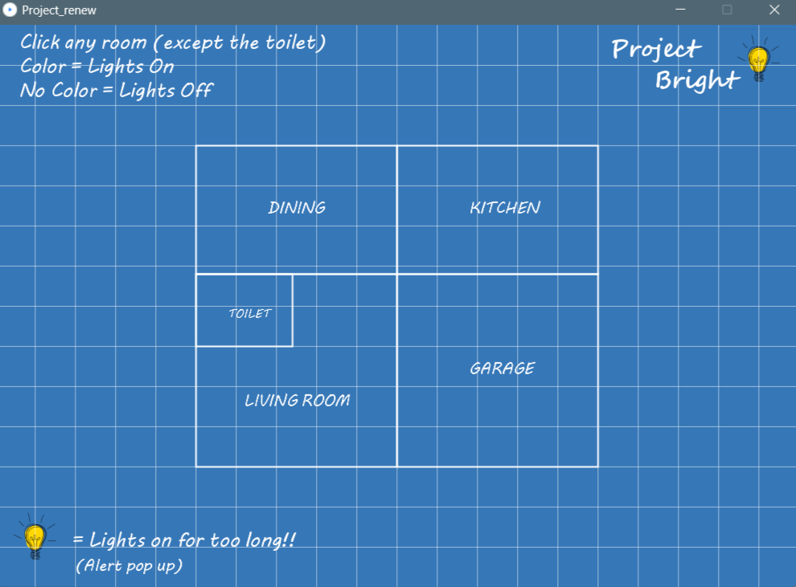
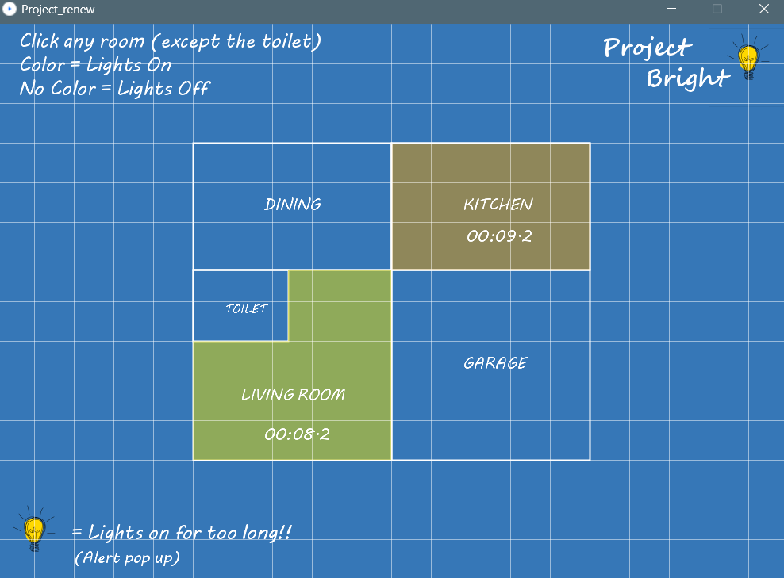
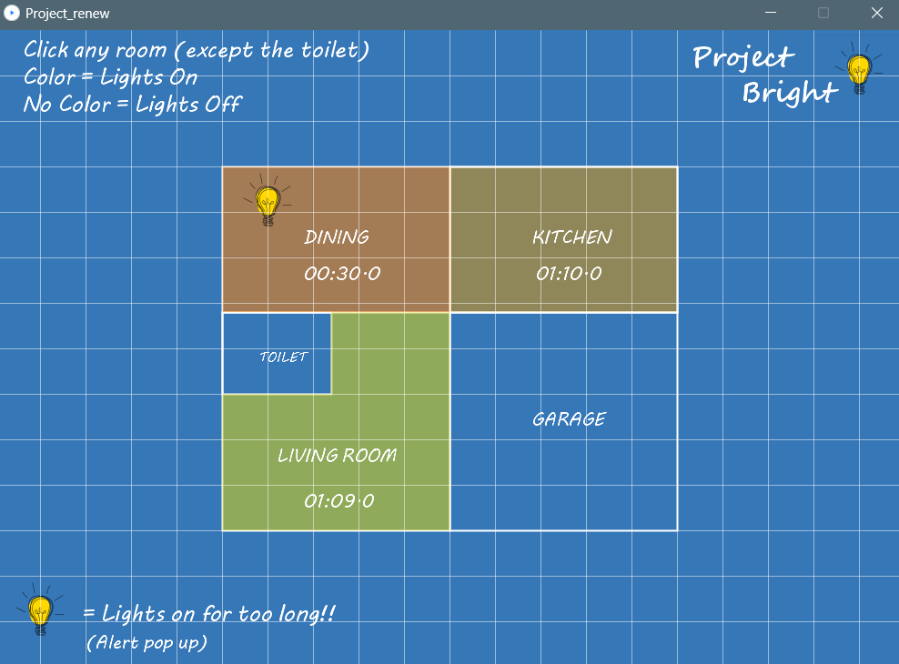

# Project Bright 💡

CS171 Computer Systems 1 project  
Theme: Sustainability and Environment  

My project is inspired by my idea for my LC_project where I've created a smart home device for home users.  
The project itself is an imitation of a smart app where the home owner can control their smart lighting system and track the duration of lights in every room of their house through a simple smart device. 

 

 
This devices enables the user to:  
💡control the light through an interactive UI  
💡be alerted if lights are on for too long  
💡know the duration of lights being on in each room of their house   

 

 

Note: This is a very simple program and UI, the time is set to seconds instead of minutes to demonstrate its functionality quickly.  

